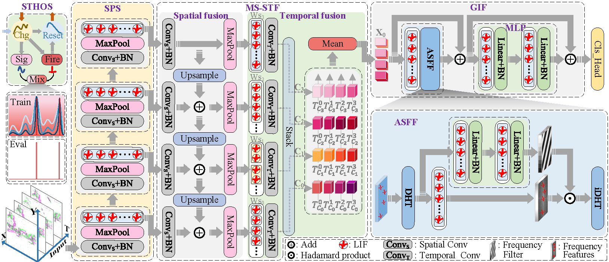

# FAME-SNN: Frequency Aware Multi-scale Enhanced Spiking Neural Network
Our codes are based on the official imagenet example by PyTorch, pytorch-image-models by Ross Wightman and SpikingJelly by Wei Fang.
<p align="center">

</p>

## Introduction
Evaluated across multiple datasets, FAME-SNN achieves SOTA Top-1 classification accuracy, compresses model size without compromising performance.

## Requirements
Ltimm==0.5.4
cupy==10.3.1
pytorch==1.10.0+cu111
spikingjelly==0.0.0.0.12
pyyaml

## Data Preparation
data prepare: ImageNet with the following folder structure, you can extract imagenet by this [script](https://gist.github.com/BIGBALLON/8a71d225eff18d88e469e6ea9b39cef4).
```
│imagenet/
├──train/
│  ├── n01440764
│  │   ├── n01440764_10026.JPEG
│  │   ├── n01440764_10027.JPEG
│  │   ├── ......
│  ├── ......
├──val/
│  ├── n01440764
│  │   ├── ILSVRC2012_val_00000293.JPEG
│  │   ├── ILSVRC2012_val_00002138.JPEG
│  │   ├── ......
│  ├── ......
```
### Training  on ImageNet
Setting hyper-parameters in Imagenet.yml

```
cd Imagenet
python -m torch.distributed.launch --nproc_per_node=4 train.py
```

### Training  on Tiny-ImageNet
Setting hyper-parameters in Tiny_Imagenet.yml

```
cd Tiny_Imagenet
python -m torch.distributed.launch --nproc_per_node=4 train.py
```

### Training  on cifar10
Setting hyper-parameters in cifar10.yml
```
cd cifar10
python train.py
```
### Training  on cifar100
Setting hyper-parameters in cifar100.yml
```
cd cifar100
python train.py
```
### Training  on cifar10DVS
```
cd cifar10dvs
python train.py
```
### Training  on DVS128-GESTURE
```
cd DVS128-GESTURE
python train.py
```
### Training  on UCF101-DVS
```
cd UCF101-DVS
python train.py
```